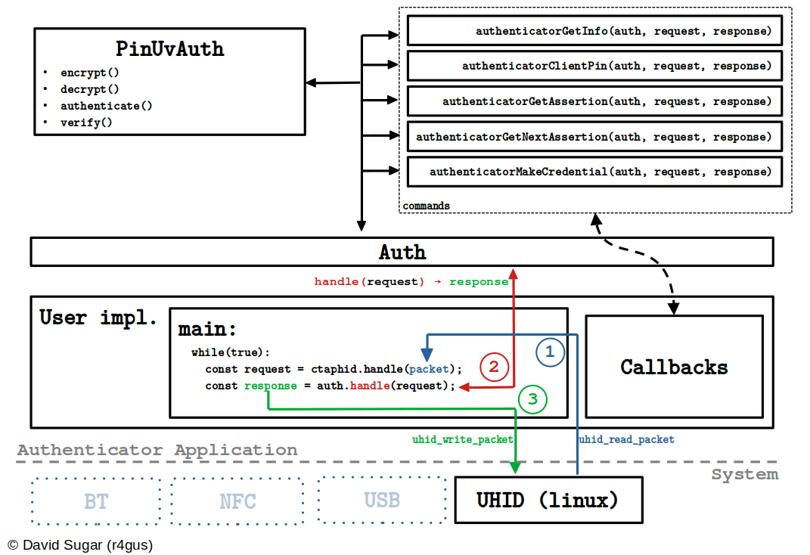

FIDO2 compatible authenticator library written in [Zig](https://ziglang.org/) with __zero dynamic allocations__.

> We track the latest stable release of Zig (`0.12.0`)

If you want to see an example on how to use keylib, check out [PassKeeZ](https://github.com/r4gus/keypass).

## QA

<ins>What is FIDO2?</ins>

FIDO2 is a protocol designed for authentication purposes. It can be used as single factor (e.g., as a replacement for password based authentication) or as a second factor (e.g., instead of OTPs).

<ins>I've heard the term Passkey but what is that?</ins>

Passkey is a marketing term which is used to refer to a specific FIDO2 authenticator configuration. A authenticator can be configured to use so called discoverable credentials (also referred to as resident keys). Those credentials are stored somewhere on your device, e.g. in a encrypted database. Devices can also be protected by some form of user verification. This can be a PIN or a built in user verification method like a finger print scanner. Passkey refers to FIDO2 using discoverable credentials and some form of user verification. 

Please note that this is only one interpretation of what PassKey means as the term itself is nowhere defined (see also [Passkeys's: A Shattered Dream](https://fy.blackhats.net.au/blog/2024-04-26-passkeys-a-shattered-dream/)).

<ins>How does it work?</ins>

FIDO2 uses asymmetric cryptography to ensure the authenticity of the user. A unique credential (key-pair) is created for each relying party (typically a web server) and bound to the relying party id (e.g., google.com). The private key stays on the authenticator and the public key is stored by the relying party. When a user wants to authenticate herself, the relying party sends a nonce (a random byte string meant to be only used once) and some other data, over the client (typically your web browser), to the authenticator. The authenticator looks up the required private key and signs the data with it. The generated signature can then be verified by the relying party using the corresponding public key.

<ins>What is the difference between FIDO2, PassKey and WebAuthn?</ins>

You might have noticed that FIDO2, PassKey and even WebAuthn are often used interchangeably by some articles and people which can be confusing, especially for people new to the protocol. Here is a short overview:

* `FIDO2` Protocol consisting of two sub-protocols: Client to Authenticator Protocol 2 (`CTAP2`) and Web Authentication (`WebAuthn`)
* `CTAP2` Specification that governs how a authenticator (e.g. YubiKey) should behave and how a authenticator and a client (e.g. web-browser) can communicate with each other.
* `WebAuthn` Specification that defines how web applications can use a authenticator for authentication. This includes the declaration of data structures and Java Script APIs.
* `PassKey`: A authenticator with a specific configuration (see above).

<ins>Why should I use FIDO2?</ins>

FIDO2 has a lot of advantages compared to passwords:

1. No secret information is shared, i.e. the private key stays on the authenticator or is protected, e.g. using key wrapping.
2. Each credential is bound to a relying party id (e.g. google.com), which makes social engineering attacks, like phishing websites, quite difficult (as long as the client verifies the relying party id properly).
3. Users don't have to be concerned with problems like password complexity.
4. If well implemented, FIDO2 provides a better user experience (e.g., faster logins).
5. A recent paper showed that with some adoptions, FIDO2 is ready for a post quantum world under certain conditions ([FIDO2, CTAP 2.1, and WebAuthn 2: Provable Security and Post-Quantum Instantiation, Cryptology ePrint Archive, Paper 2022/1029](https://eprint.iacr.org/2022/1029.pdf)).

<ins>Are there problems with FIDO2?</ins>

Yes, there are:

1. The two FIDO2 subprotocols (CTAP2 and WebAuthn) are way more difficult to implement, compared to password authentication. 
2. There are more points of failure because you have three parties that are involved in the authentication process (authenticator, client, relying party).
3. Currently not all browsers support the CTAP2 protocol well (especially on Linux).
4. There is no way to verify that a client is trustworthy:
    * Rogue clients may communicate with a authenticator without your consent
    * Clients may display wrong information
5. The 4th layer introduced for Android, IOS, and Windows to connect authenticators and clients internally could be used as a man in the middle.

<ins>Does this library work with all browsers?</ins>

Answering this question isn't straightforward. The library, by its nature, is designed to be independent of any particular platform, meaning that you have the responsibility of supplying it with data for processing. To put it differently, you're in charge of creating a functional interface for communicating with a client, typically a web browser. On Linux, we offer a wrapper for the uhid interface, simplifying the process of presenting an application as a USB HID device with a Usage Page of F1D0 on the bus.

<ins>Does this library implement the whole CTAP2 sepc?</ins>

No, we do not fully implement the entire [CTAP2](https://fidoalliance.org/specs/fido-v2.2-rd-20230321/fido-client-to-authenticator-protocol-v2.2-rd-20230321.html#intro) specification. In the initial version of this library, which can be found on GitHub, our aim was to remain completely platform-agnostic and cover most of the CTAP2 specification. However, this approach introduced complexities for both users and developers. The current version of this library strikes a balance between usability and feature completeness.

We offer support for operations like __authenticatorMakeCredential__, __authenticatorGetAssertion__, __authenticatorGetInfo__, and __authenticatorClientPin__, with built-in support for __user verification__ and the __pinUvAuth protocol__ (versions 1 and 2). You are responsible for handling data management tasks (such as secure storage, updates, and deletions), verifying user presence, and conducting user verification. These responsibilities are fulfilled by implementing the necessary callbacks used to instantiate an authenticator (refer to the "Getting Started" section for details).

<ins>Zero dynamic allocations?</ins>

This library doesn't allocate any memory dynamically. This has some draw backs like a fixed
size for strings (e.g., rpId, user name, etc.) but also reduces the complexity of the code,
i.e., no memory bugs due to allocations.

The authenticator example uses `88655` bytes of stack space when compiled with `-Doptimize=ReleaseSmall` on Linux (x86\_64).

> The authenticator example has been profiled using valgrind. 
> * `zig build auth-example -Doptimize=ReleaseSmall` 
> * `valgrind --tool=drd --show-stack-usage=yes ./zig-out/bin/authenticator`
> * Test page: [webauthn.io](https://webauthn.io/) - Register + Authentication
> `thread 1 finished and used 88655 bytes out of 8388608 on its stack.`
> `ThinkPad-X1-Yoga-3rd 6.5.0-35-generic #35~22.04.1-Ubuntu SMP PREEMPT_DYNAMIC x86_64 GNU/Linux`

## Design

## Getting Started

We maintain two examples on how to use the library:

* `authenticator` - [https://github.com/r4gus/keylib/blob/master/example/authenticator.zig](https://github.com/r4gus/keylib/blob/master/example/authenticator.zig)
* `client` - [https://github.com/r4gus/keylib/blob/master/example/client.zig](https://github.com/r4gus/keylib/blob/master/example/client.zig)

## Resources

- [CTAP2](https://fidoalliance.org/specs/fido-v2.1-ps-20210615/fido-client-to-authenticator-protocol-v2.1-ps-errata-20220621.html#intro) - FIDO Alliance
- [WebAuthn](https://www.w3.org/TR/webauthn-3/) - W3C
- [CBOR RFC8949](https://www.rfc-editor.org/rfc/rfc8949.html) - C. Bormann and P. Hoffman

---

__FIDO2/Passkey test sites__:
- [passkey.org](https://passkey.org/)
- [webauthn.io](https://webauthn.io/)

## Random Ideas

<ins>Protecting secrets using a PIN</ins>

Microcontrollers like the rp2040 allow the creation of cheap authenticators but they provide no means to somehow protect
secrets like master passwords, PINs, or credentials. One way one could securely store sensitive data is by making PIN
protection mandatory. Note that this is a tradeof and will render some counters (like the pin retry counter) useless if
an attacker has physical access to the chip, as one can not protect the counters from manipulation.

1. Your authenticator has PIN protection enabled by default, i.e. on first boot a default password is set. You should also
set the _force pin change_ flag to "encourge" the user to change his password.
2. Also on first boot, you create a master password which will encrypt all sensitive data using a AEAD cipher. The master
password itself is encrypted using a secret derived from the PIN.
3. Metadata like retry counters are not encrypted (make sure you __DONT__ store the PIN unencrypted!). This still allows
the blocking of a authenticator (in fact you should automatically reset the authenticator if the retry counter hits zero)
but an attack with physical access could potentially reset the counters giving him unlimited retries.
4. Make sure you disallow any operations on sensitive data without prior authentication (__alwaysUv__).
5. Make sure you only use PIN authentication.
6. During authentication you intercept the PIN hash (after decryption) and derive a deterministic secret from it
using a key derivation function of you choice (e.g. HKDF; but it must always be the same). This secret must have
the same lifetime as the pinUvAuthToken! 
7. When the application requires a credential (or other sensitive data) you decrypt the master secret using the
derived secret and the decrypt the actual data with the master secret. If the application wants to overwrite data,
you decrypt the data, update it and the encrypt it using the master secret.
8. After you're done, make sure to overwrite any plain text information no longer required.
9. On pin change, just decrypt the master secret and then re-encrypt it using the secret derived
from the new PIN hash.

