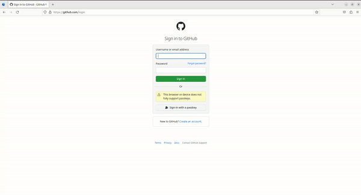

> _Warning_: NOT PRODUCTION READY!
> We track the latest stable release of Zig (`0.11.0`)

FIDO2 compatible authenticator library written in [Zig](https://ziglang.org/).

## QA

<details>
<summary><ins>What is FIDO2?</ins></summary>

FIDO2 is a protocol designed for authentication purposes. It can be used as single factor (e.g., as a replacement for password based authentication) or as a second factor.

</details>

<details>
<summary><ins>I've heard the term Passkey but what is that?</ins></summary>

Passkey is a marketing term which is used to refer to a specific FIDO2 configuration. FIDO2 can be configured to use so called discoverable credentials (also referred to as resident keys). Those credentials are stored somewhere on your device, e.g. in a encrypted database. FIDO2 can also be protected by some form of user verification. This can be a PIN or a built in user verification method like a finger print scanner. Passkey refers to FIDO2 using discoverable credentials and some form of user verification.

</details>

<details>
<summary><ins>How does it work?</ins></summary>

FIDO2 uses asymmetric cryptography to ensure the authenticity of the user. A unique credential (key-pair) is created for each relying party (typically a web server) and bound to the relying party id (e.g., google.com). The private key stays on the authenticator and the public key is stored by the relying party. When a user wants to authenticate herself, the relying party sends a nonce (a random byte string meant to be only used once) and some other data, over the client (typically your web browser), to the authenticator. The authenticator looks up the required private key and signs the data with it. The generated signature can then be verified by the relying party using the corresponding public key.

</details>

<details>
<summary><ins>Why should I use FIDO2?</ins></summary>

FIDO2 has a lot of advantages compared to passwords:

1. No secret information is shared, i.e. the private key stays on the authenticator or is protected, e.g. using key wrapping.
2. Each credential is bound to a relying party id (e.g. google.com), which makes social engineering attacks, like phishing websites, quite difficult (maybe impossible).
3. Users don't have to be concerned with problems like password complexity.
4. If well implemented, FIDO2 provides a better user experience (e.g., faster logins).
5. A recent paper showed that with some adoptions, FIDO2 is ready for a post quantum world under certain conditions ([FIDO2, CTAP 2.1, and WebAuthn 2: Provable Security and Post-Quantum Instantiation, Cryptology ePrint Archive, Paper 2022/1029](https://eprint.iacr.org/2022/1029.pdf)).

</details>

<details>
<summary><ins>Why shouldn't I use FIDO2?</ins></summary>

1. The two FIDO2 subprotocols (CTAP2 and WebAuthn) are way more difficult to implement, compared to password authentication.
2. There are more points of failure because you have three parties that are involved in the authentication process (authenticator, client, relying party).
3. Currently not all browsers support the CTAP2 protocol well (especially on Linux).
4. You don't want to spend mony on an authenticator (you usually can't upgrade) and/or you don't trust platform authenticators.

</details>

## Examples

### Login with FIDO2


### Login using Passkey (FIDO2 with discoverable credential)



## Docs

<details>
<summary><ins>Getting started</ins></summary>
To use this library you can either add it directly as a module or use the Zig package manager to fetch it as a dependency.

### Zig package manager

First add this library as dependency to your build.zig.zon file, e.g.,:

```zon
.{
    .name = "your-project",
    .version = 0.0.1,

    .dependencies = .{
        .scallop = .{
            .url = "https://github.com/r4gus/scallop/archive/main.tar.gz",
            .hash = "122036646fd5c72c265f2eb4dfc4b9891696a38e7c614b234b3ea65795eb2584d052",
        }
    },
}
```

#### Hash

Currently, the easiest way to get the correct hash value is to flip the last digit and then try to run `zig build`.
The actual hash will be listed in the error message.

### As a module

First add the library to your project, e.g., as a submodule:

```
your-project$ mkdir libs
your-project$ git submodule add https://github.com/r4gus/scallop.git libs/scallop
```

Then add the following line to your `build.zig` file.

```zig
// Create a new module
var scallop_module = b.createModule(.{
    .source_file = .{ .path = "libs/scallop/lib/main.zig" },
});

// create your exe ...

// Add the module to your exe/ lib
exe.addModule("scallop", scallop_module);
```

</details>

<details>
<summary><ins>FIDO2 authenticator</ins></summary>

You can use this library to implement roaming and platform FIDO2 authenticators. It makes no assumptions about the
underlying hardware, instead the user of this library is responsible to provide the necessary resources (see below).

### Getting started

The following steps are required to get started:

1. Add this repository to your project
2. Implement a basic application that acts as a raw usb hid device (nfc and bluetooth are currently not supported, but you could write the transport code yourself)
3. Define the following callbacks:
  - `std.rand.Random` - A Zig interface of type `std.rand.Random` (e.g., `std.crypto.random`)
  - `pub fn millis() i64` - The time in milliseconds since startup, the epoch time, or something similar (e.g., `std.time.milliTimestamp`)
  - `pub fn up(reason: UpReason, user: ?*const scallop.common.User, rp: ?*const scallop.common.RelyingParty) UpResult` - Request permission from the user (e.g., button press)
  - `pub fn uv() bool` - (OPTIONAL): Callback for a built-in user verification method
  - `pub fn getEntry(id: []const u8) ?*cks.Entry` - Load an [Entry](https://github.com/r4gus/scallop/blob/main/cks/Entry.zig) with the given `id`. A `Entry` either represents the general settings of the authenticator (the library assumes that a entry with the id `Settings` is always available) or a resident (discoverable) credential. 
  - `pub fn addEntry(entry: cks.Entry) cks.Error!void` - The given entry should be added to a set of existing entries. _NOTE: If you don't want to support resident keys, you can just return an error by default_.
  - `pub fn createEntry(id: []const u8) cks.Error!cks.Entry` - Create a new entry with the given id. _NOTE: If you don't want to support resident keys, you can just return an error by default_.
  - `pub fn getEntries() ?[]cks.Entry` - Get a slice of all entries available. _NOTE: If you don't want to support resident keys, you can just return an error by default_.
  - `pub fn persist() error{Fatal}!void` - Persist all changes made to entries. This function has to be implemented because the `Settings` entry will change from time to time and those changes have to be persisted.
  - `pub fn reset() void` - Reset the authenticator. The currently set pin and all credentials have to be invalidated!
  - `pub fn validate_pin_constraints(pin: []const u8) bool` - (OPTIONAL): This allows the implementation of arbitrary pin constraints.
4. On startup create a new authenticator instance, defining its capabilities:
```zig
var authenticator = scallop.ctap.authenticator.Authenticator{
    .settings = .{
        .versions = &.{ .FIDO_2_0, .FIDO_2_1 },
        .aaguid = "\x6f\x15\x82\x74\xaa\xb6\x44\x3d\x9b\xcf\x8a\x3f\x69\x29\x7c\x88".*,
        .options = .{
            .uv = false,
            // This is a platform authenticator even if we use usb for ipc
            .plat = true,
            // Set clientPin to false if you wanna support a pin and to none
            // if you don't want to use a pin at all. Never set this to true!
            .clientPin = false,
            .pinUvAuthToken = true,
            .alwaysUv = true,
        },
        .pinUvAuthProtocols = &.{.V2},
        .transports = &.{.usb},
        // Please make sure that this list matches the (algorithms) list below!
        .algorithms = &.{.{ .alg = .Es256 }},
        .firmwareVersion = 0xcafe,
    },
    .attestation_type = .Self,
    .callbacks = .{
        .rand = std.crypto.random,
        .millis = std.time.milliTimestamp,
        .up = callbacks.up,
        .createEntry = callbacks.createEntry,
        .getEntry = callbacks.getEntry,
        .getEntries = callbacks.getEntries,
        .addEntry = callbacks.addEntry,
        .persist = callbacks.persist,
        .reset = callbacks.reset,
    },
    .algorithms = &.{
        scallop.ctap.crypto.algorithms.Es256,
    },
    .token = .{
        //.one = scallop.ctap.pinuv.PinUvAuth.v1(callbacks.rand),
        .two = scallop.ctap.pinuv.PinUvAuth.v2(std.crypto.random),
    },
    .allocator = allocator,
};

if (authenticator.token.one) |*one| {
    one.initialize();
}
if (authenticator.token.two) |*two| {
    two.initialize();
}
```
6. On receiving a usb packet call `scallop.ctap.transports.ctaphid.authenticator.handle(buffer[0..bufsize], &auth)` where `buffer` contains the raw data and `auth` is the authenticator instance
7. `ctaphid.handle` will either return null (if its still in the process of assembling the request) or an iterator (containing the response). You can call `next()` on the iterator to get the next CTAPHID packet to send to the client.
```zig
if (response) |*resp| {
    while (resp.next()) |packet| {
        try usb.write(packet);
    }
}
```

#### Examples (outdated)

| Platform | Architecture | Link |
|:--------:|:------------:|:----:|
| nRF52840-MDK USB Dongle | Arm | [candy-stick-nrf](https://github.com/r4gus/candy-stick-nrf) |

### Supported transport specific bindings

| binding           | supported? |
|:-----------------:|:----------:|
| USB | ✅ |
| NFC |    |
| Bluetooth |   |


### Supported commands

| command           | supported? |
|:-----------------:|:----------:|
| `authenticatorMakeCredential`     | ✅ |
| `authenticatorGetAssertion`       |✅  |
| `authenticatorGetNextAssertion`   |    |
| `authenticatorGetInfo`            | ✅ |
| `authenticatorClientPin`          | ✅ |
| `authenticatorReset`              | ✅ |
| `authenticatorBioEnrollment`      |    |
| `authenticatorCredentialManagement` |    |
| `authenticatorSelection`          |  ✅   |
| `authenticatorLargeBlobs`         |    |
| `authenticatorConfig`             |    |

#### Supported clientPin commands

| sub-command           | supported? |
|:-----------------:|:----------:|
| `getPINRetries`     |  ✅  |
| `getKeyAgreement`     |  ✅  |
| `setPIN`     |  ✅  |
| `changePIN`     |  ✅  |
| `getPinToken`     |  |
| `getPinUvAuthTokenUsingUvWithPermission`     |  |
| `getUVRetries`     |  |
| `getPinUvAuthTokenUsingPinWithPermission`     |  ✅  |

### Supported signature algorithms

The following signature algorithms (`scallop.ctap.crypto.SigAlg`) are supported
by the library:

| sub-command           | supported? |
|:-----------------:|:----------:|
| Es256 (ECDSA-P256-SHA256)  |  ✅  |

You can add more algorithms by instantiating [`SigAlg`](https://github.com/r4gus/scallop/blob/main/lib/ctap/crypto/SigAlg.zig) and adding your
instance to `Authenticator.algorithms`.

Each `SigAlg` instance has a `cbor.cose.Algorithm` field, a `create` and a `sign` function.

* `create` - Create a new key pair (see: `scallop.ctap.crypto.SigAlg.KeyPair`). The `KeyPair`s
`cose_public_key` field should contain the CBOR encoded [COSE](https://datatracker.ietf.org/doc/html/rfc8152) public key and the `raw_private_key` should contain the raw private key.

* `sign` - Function for signing data. It takes the private key generated by `create`.

See `lib/ctap/crypto/sigalgs/Es256.zig` for reference.


### Are we yet?

This is all theoretical! At the end it depends on the actual configuration.

#### Are we FIDO\_2\_1 yet?

| requirement           | supported? |
|:-----------------:|:----------:|
| MUST support the hmac-secret extension  | |
| clientPin or uv + resident key  |  ✅  |
| credMgmt  |  ✅  |
| MUST support credProtect extension |  ✅  |
| pinUvAuthToken  |  ✅  |
| PIN/UV auth protocol two support |  ✅  |
    
</details>

<details>
<summary><ins>Browser Support</ins></summary>

### USB

| Browser | Credential Creation | Login | PassKey Creation | PassKey Login |
|:-------:|:-------------------:|:-----:|:----------------:|:-------------:|
| Brave   |      ✅             |  ✅   |      ✅          |     ✅        |
| Chromium |      ✅             |  ✅   |      ✅          |     ✅        |
| Firefox |                     |       |                  |       ✅      |

### NFC

n.a.

### Bluetooth

n.a.

</details>

## Resources

- [CTAP2](https://fidoalliance.org/specs/fido-v2.1-ps-20210615/fido-client-to-authenticator-protocol-v2.1-ps-errata-20220621.html#intro) - FIDO Alliance
- [WebAuthn](https://www.w3.org/TR/webauthn-3/) - W3C
- [CBOR RFC8949](https://www.rfc-editor.org/rfc/rfc8949.html) - C. Bormann and P. Hoffman

---

- [Passkey test site](https://passkey.org/)
- [FIDO2 test site](https://webauthn.io/)
